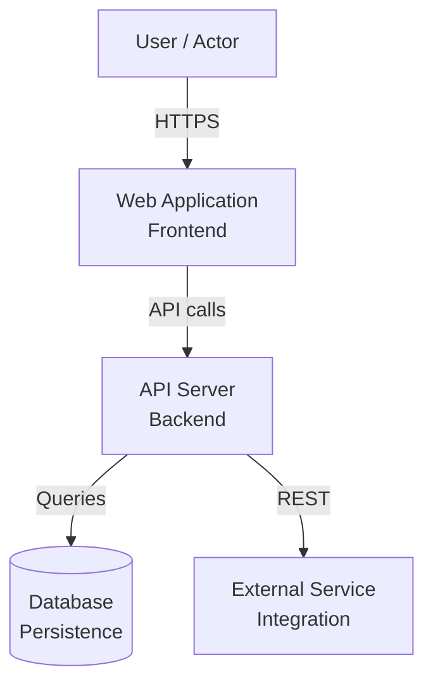
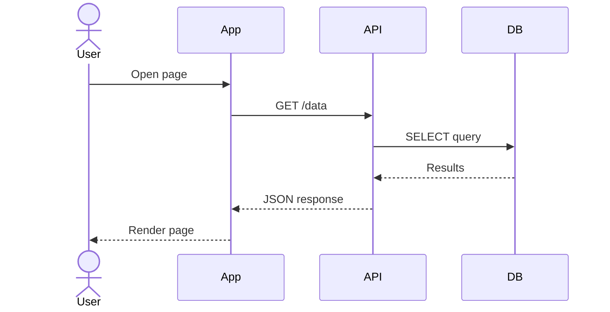
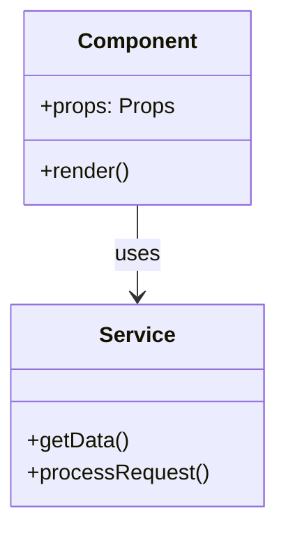

# DocGen — code documentation generator

Generate one or more documentation artifacts for the repository in the current
working directory, from real code analysis only.

## Arguments

`$ARGUMENTS` is a space-separated list, all parts optional and order-free:

- **repo path** — a token that names an existing directory (contains `/`, or is `.`,
  or resolves to a directory). Defaults to the current working directory. This is
  the **repository root**: everything is read from it and output goes inside it.
- **language** — `--lang <code>` / `--lang=<code>` (e.g. `pt-BR`, `es`, `en`).
  Defaults to **English**.
- **doc types** — everything else. Empty → produce **all 8**, in the order listed
  below. Matched loosely: `c4`, `c4-models` and `c4_models` all select `c4-models.md`.

If a token matches no doc type and is not an existing directory, list the valid
types and stop rather than guessing.

| doc type | output file |
|---|---|
| `readme` | `README.md` |
| `wiki` | `wiki.md` |
| `business-rules` | `business-rules.md` |
| `business-overview` | `business-overview.md` |
| `technical-overview` | `technical-overview.md` |
| `c4-models` | `c4-models.md` |
| `uml-diagrams` | `uml-diagrams.md` |
| `project-overview` | `project-overview.md` |

## Procedure

1. **Scan.** Build a picture of the repo before writing anything:
   `git -C <repo> ls-files` (fall back to `find <repo>` if not a git repo) for the
   file inventory; read the
   manifest (`package.json`, `pyproject.toml`, `go.mod`, `pom.xml`, …), the
   entrypoints, the config, and the modules that carry the domain logic. Read
   enough real code to write specifics — file names, function names, class names.
   Skip vendored trees (`node_modules`, `.venv`, `vendor`, `dist`, `build`) and
   anything `.gitignore`d.
2. **Write.** For each selected doc type, compose the full markdown per the shared
   rules and the per-document spec below, then `Write` it to
   `<repo>/docgen-output/<output file>`. Create the directory if missing. One
   complete document per file — never a stub, never a placeholder.
3. **Report.** List the files written with their sizes.

## Shared rules (apply to every document)

**Ground every claim in the code you read.** Never invent a feature, dependency,
endpoint, or workflow that is not in the repository. If the code does not support
a required section, say so explicitly in that section and explain what the code
does instead — an honest short section beats a fabricated long one.

**Minimum depth.** Each document is a real deliverable, not an outline: aim for
1000+ words, with concrete references to actual files and symbols.

### Language

Write **all prose in the selected language** (default English): body text, headings,
table headers, diagram labels, list items. The per-document specs below name their
required sections in English — translate those headings into the output language,
keeping the meaning. Never translate: code, identifiers, file and directory names,
command lines, config keys, dependency names, and the Mermaid keywords themselves.

### Style

- Clear, professional prose in the output language. Active voice.
- Be specific — reference actual file names, function names, class names.
- Tables for structured data, lists for enumerations.
- Include code examples where relevant.
- Never include secrets, credentials, tokens, or connection strings. If you read
  one, do not reproduce it — refer to the variable name only.

### Mermaid rules

All Mermaid diagrams MUST follow these rules strictly to avoid parse errors:

- Be in ```mermaid code blocks
- Start with a valid diagram type on the FIRST line (graph, flowchart, sequenceDiagram,
  classDiagram, stateDiagram, erDiagram, C4Context, C4Container, C4Component)
- Have balanced brackets: every ( must have ), every [ must have ], every { must have }
- Node IDs: ONLY letters, numbers, underscores. NO spaces, NO special characters.
- Node labels in brackets: NO quotes, NO parentheses, NO special chars that conflict
  with Mermaid syntax. Use plain text or <br/> for line breaks.
- Arrows: use --> for solid, -.-> for dotted, ==> for thick in flowcharts.
  Use ->> for solid, -->> for dashed in sequence diagrams.
- NEVER use ( or ) inside node labels in [] brackets — it breaks parsing.
- NEVER use " (quotes) inside node labels — it breaks parsing.
- Keep labels SHORT and simple. If complex, use a separate note.
- Each diagram must have at least 3 nodes/participants and 2 connections.
- Subgraphs: `subgraph Title` ... `end` (Title has NO brackets).

Common errors to AVOID:

- `A[Label (with parens)]` → WRONG. Use `A[Label with parens]` or `A[Label - detail]`
- `A["quoted label"]` → WRONG. Use `A[Label]`
- `My Node[Label]` → WRONG (space in ID). Use `MyNode[Label]`
- `A --> B[Label]` → WRONG. Use `A -->|Label| B` for edge labels.

### Structure

Every document starts with a single `# Title` H1. Required sections are H2
headings whose text includes the listed keywords. Do not skip heading levels.

---

## README.md

**Required sections:**

- Overview / Description — what the project does, its purpose
- Features — key features and capabilities
- Prerequisites / Requirements — what's needed to run it
- Installation / Getting Started — step-by-step setup
- Usage — how to use the project, with examples
- Project Structure — directory layout explanation
- Configuration — environment variables, config files
- Contributing — how to contribute

**Target audience:** Developers who need to understand, set up, and contribute to the project.

## wiki.md

**Required sections:**

- Architecture — system architecture and design patterns
- Development Setup / Getting Started — detailed dev environment setup
- Code Organization / Project Structure — detailed directory and module explanation
- Key Components / Modules — deep dive into important parts
- Testing — how to run and write tests
- Deployment — deployment process and environments
- Troubleshooting — common issues and solutions

**Target audience:** New team members who need a thorough onboarding reference.

## business-rules.md

**Required sections:**

- Validation Rules / Input Validation — data validation logic
- Authorization / Access Control — auth rules and permissions
- Business Logic / Workflow Rules — core business workflows
- Data Constraints — data integrity rules
- Error Handling — business error scenarios

Document what you find honestly — if few rules exist, explain why.

**Target audience:** Business analysts, QA engineers, product managers.

## business-overview.md

**Required sections:**

- Executive Summary — high-level project summary in business terms
- Business Context / Purpose — why this project exists, what problem it solves
- Key Capabilities / Features — what the system does (non-technical language)
- Stakeholders / Users — who uses the system
- Value Proposition — business value delivered
- Future Considerations — potential improvements

**Target audience:** Non-technical stakeholders, executives, product owners.
Write in accessible language without technical jargon.

## technical-overview.md

**Required sections:**

- Architecture Overview — system architecture, patterns, design decisions
- Technology Stack — languages, frameworks, libraries with versions
- Key Components — detailed component descriptions
- Data Flow / Integration Points — how data moves, external integrations
- Security / Authentication — security measures, auth mechanisms
- Performance — performance considerations
- Infrastructure — deployment, CI/CD, environments

**Target audience:** Senior engineers, architects, DevOps.

## c4-models.md

**Required sections:**

- Context Diagram — system context showing actors and external systems
- Container Diagram — containers (web app, API, database, etc.)
- Component Diagram (optional) — internal components of a container

**CRITICAL: Valid Mermaid Diagrams Required**

Each section MUST include a ```mermaid code block with a valid diagram.

For C4 diagrams, prefer using `flowchart` or `graph` with descriptive labels since
C4 Mermaid syntax can be fragile. Example of a valid C4-style diagram:



Rules for valid mermaid:

- Use simple node IDs (letters/numbers only, no spaces)
- Use [] for rectangles, () for rounded, [()] for cylinders, {} for diamonds
- Use --> for arrows, -->|label| for labeled arrows
- Every opening bracket must have a matching close bracket
- NO quotes inside node labels — use <br/> for line breaks

**Target audience:** Architects and senior engineers.

## uml-diagrams.md

**Required: At least 3 Mermaid diagram blocks covering different UML views.**

Choose from (include at least 3):

- **Sequence Diagram** — key user flows or API interactions
- **Class Diagram** — major classes/components and relationships
- **Flowchart** — activity or process flows
- **State Diagram** — state transitions for key entities

Example valid sequence diagram:



Example valid class diagram:



Rules for valid mermaid:

- Use simple identifiers (no spaces, no special characters in IDs)
- For sequence diagrams: participant/actor declarations first, then interactions
- For class diagrams: class definitions first, then relationships
- Every opening bracket must have a matching close
- Use ->> for solid arrows, -->> for dashed arrows in sequence diagrams
- Use --> for associations in class diagrams

**Target audience:** Developers and architects.

## project-overview.md

**Required sections:**

- Project Summary / Overview — comprehensive project description
- Architecture — high-level architecture description
- Technology Stack — complete technology inventory
- Key Features / Capabilities — feature inventory
- Code Organization — how the code is structured
- Dependencies — key dependencies and their purposes
- Development Workflow — how the team works with this codebase

**Target audience:** AI systems and new developers who need a comprehensive
single-document understanding of the entire project. This document should be
self-contained and serve as the definitive reference for understanding the project.