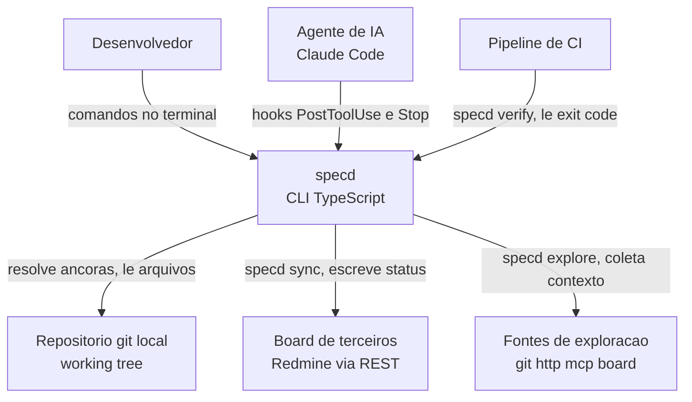
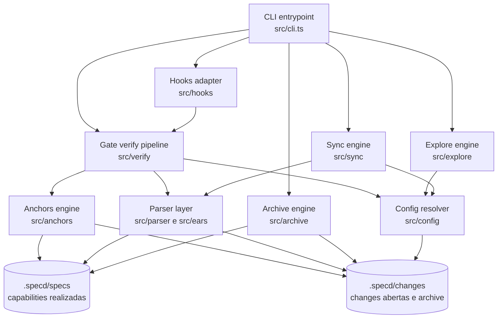
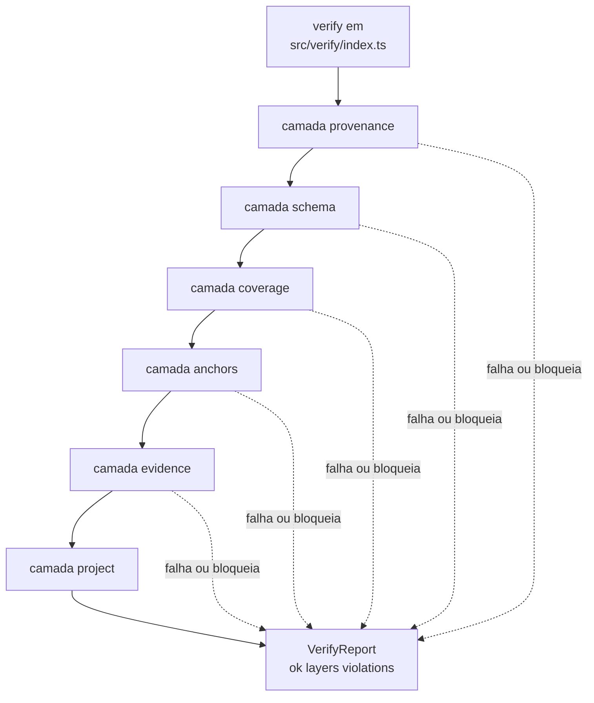

# Modelos C4 — specd

Este documento descreve a arquitetura do `specd` usando o modelo C4 (Contexto,
Container, Componente), adaptado à realidade do projeto: `specd` não é um
serviço web com frontend, backend e banco de dados — é uma **CLI TypeScript**
que roda localmente, invocada por um desenvolvedor ou por um agente de IA, e
que lê e escreve arquivos no repositório git local. Onde o C4 clássico fala em
"aplicação web" e "banco de dados", aqui falamos em "processo de linha de
comando", "árvore de trabalho git" e "diretório `.specd/`". Os diagramas
seguem a recomendação de usar `graph`/`flowchart` do Mermaid em vez da
sintaxe `C4Context`/`C4Container`, por ser mais estável na renderização.

A fonte de verdade para esta descrição é o próprio código: `src/cli.ts` e
`src/cli/` para o roteamento de comandos, `src/verify/index.ts` para o pipeline
do gate, `src/hooks/protocol.ts` para o contrato de hooks, e os diretórios
`src/anchors/`, `src/explore/`, `src/sync/`, `src/archive/`, `src/parser/`,
`src/ears/` e `src/config/` para os módulos internos. O `README.md` e o
`CLAUDE.md` do repositório fornecem a terminologia dos princípios (P1 a P9) e
do contrato de exit code que os diagramas respeitam.

## Diagrama de Contexto

O diagrama de contexto mostra o `specd` como uma caixa única vista de fora:
quem interage com ele e quais sistemas externos ele toca. Diferente de um
sistema web, o `specd` não tem usuários "conectando-se" a ele por rede — ele é
invocado como processo de linha de comando, seja diretamente por um
desenvolvedor no terminal, seja por um agente de IA (como o Claude Code)
através de hooks de ciclo de vida, seja por um pipeline de CI que precisa de
um exit code determinístico.

Os atores e sistemas externos reais, extraídos do código e da documentação,
são:

- **Desenvolvedor**, que roda `specd verify`, `specd explore`, `specd sync`
  etc. diretamente no terminal.
- **Agente de IA (Claude Code)**, que invoca `specd hooks run` nos eventos
  `PostToolUse` e `Stop`, conforme `src/hooks/protocol.ts` — o módulo que
  traduz o contrato de exit code do specd (0 sucesso, 1 gate reprovado, 2
  falha operacional) para o contrato de hook do host (0 permite, 2 bloqueia e
  devolve stderr ao agente).
- **Repositório git local (working tree)**, de onde o `specd` lê arquivos de
  código-fonte para resolver âncoras (`src/anchors/resolve.ts`,
  `src/anchors/search.ts`, que usa `git ls-files`) e onde grava mudanças em
  `.specd/`.
- **Board de terceiros (Redmine hoje, Azure DevOps desenhado mas não
  medido)**, acessado via REST apenas por `specd sync`
  (`src/sync/adapters/redmine.ts`), nunca pelo gate — essa é a garantia do
  princípio P3.
- **Fontes de exploração configuráveis** — git, http, mcp, board
  (`src/explore/sources/{git,http,mcp,board}.ts`) — usadas só por
  `specd explore` para montar um bundle de contexto auditável.
- **Pipeline de CI**, que invoca `specd verify` e depende do exit code para
  decidir se o build passa.

O diagrama a seguir representa essas relações. Note que `specd verify`, o
gate, está isolado das setas de rede: só `explore` e `sync` tocam sistemas
externos, o que é exatamente o que o princípio P3 exige e o que a suíte de
testes de arquitetura do repositório verifica de forma automática.

Um ponto importante que o diagrama não consegue expressar sozinho: as setas
que saem de `Specd` em direção a `Board` e `ExploreSrc` só existem quando o
comando executado é `sync` ou `explore`. Quando o comando é `verify`, nenhuma
dessas setas é percorrida — é isso que torna o gate determinístico e offline,
e é a razão pela qual `npm run verify` roda sem Docker e sem rede. A seta em
direção a `Git`, por outro lado, é percorrida por praticamente todo comando,
porque a resolução de âncoras contra a árvore de trabalho é o núcleo do que o
`specd` verifica.

## Diagrama de Container

Em um sistema web, "container" normalmente significa aplicação frontend, API
backend, banco de dados. No `specd`, que é um binário único, os "containers"
são as fronteiras internas reais do processo — os módulos de nível superior
que compõem o CLI — mais os artefatos persistentes em disco que fazem o papel
de armazenamento. Essa tradução segue a orientação do enunciado da tarefa e
reflete a estrutura real de `src/`.

Os containers identificados a partir da árvore de `src/` são:

- **CLI entrypoint** (`src/cli.ts`, `src/cli/`) — ponto de entrada do
  binário; faz o roteamento de subcomandos (`init`, `explore`, `verify`,
  `status`, `anchor`, `sync`, `archive`, `hooks run`) e traduz o resultado de
  cada um para o exit code correspondente.
- **Gate / pipeline verify** (`src/verify/`) — implementa `verify()`, a única
  função cujo resultado decide exit code 1 por reprovação de qualidade
  (princípio P2). Roda seis camadas ordenadas: provenance, schema, coverage,
  anchors, evidence, project.
- **Anchors engine** (`src/anchors/`) — resolve âncoras declaradas nos
  requisitos contra o working tree (`resolve.ts`) e sugere âncoras a partir de
  arquivos (`search.ts`, `suggest`).
- **Parser layer** (`src/parser/`, `src/ears/`) — interpreta o Markdown com
  frontmatter das capabilities em `.specd/specs/` e das changes em
  `.specd/changes/`, e valida a gramática EARS dos statements de requisito.
- **Explore engine** (`src/explore/`) — coleta bundles de contexto a partir
  das fontes configuráveis (git, http, mcp, board) para `specd explore`.
- **Sync engine** (`src/sync/`) — reconcilia a spec com um board externo via
  adaptador (`src/sync/adapters/redmine.ts`), rodando só sob invocação manual
  de `specd sync`, nunca a partir de hook.
- **Archive engine** (`src/archive/`) — aplica o `delta.md` de uma change
  encerrada às capabilities em `.specd/specs/` e move o diretório da change
  para `archive/`.
- **Hooks adapter** (`src/hooks/`) — traduz o contrato de exit code do specd
  para o contrato de hook do Claude Code, conforme `src/hooks/protocol.ts`.
- **Config resolver** (`src/config/`) — lê e valida `.specd/config.toml`.
- **Armazenamento `.specd/specs/`** — a verdade realizada: capabilities com
  requisitos, cada um com ID estável, statement EARS e âncoras.
- **Armazenamento `.specd/changes/`** — changes abertas (com `explore/`,
  `delta.md`, `tasks/`, `memory/`) e o subdiretório `archive/` para as
  encerradas.

O diagrama abaixo mostra como esses containers se relacionam. O CLI
entrypoint distribui a chamada para o módulo correspondente ao comando; cada
módulo interno depende do Parser layer e do Config resolver para interpretar
o estado em disco, e o Gate depende de Anchors, Parser e Config para compor
as seis camadas, mas nunca do Sync engine nem do Explore engine — essa
ausência de aresta é o que impede o gate de tocar rede.

Duas restrições estruturais valem a pena destacar porque estão documentadas
como decisão deliberada e não como lacuna acidental. Primeiro, não existe
aresta de `Gate` para `Explore` nem para `Sync`: o pipeline de `verify` não
importa nenhum desses módulos, o que é garantido por um teste de arquitetura
que falha o CI se a importação aparecer — é a materialização em código do
princípio P3. Segundo, `Archive` escreve em `Specs` mas o próprio código não
commita a mudança automaticamente; quem revisa e decide gravar o commit é o
autor, o que é a instância do princípio P9 citada no `CLAUDE.md` do
repositório — a ferramenta reescreve o arquivo, mas deixa a operação fora do
índice até que alguém revise.

## Diagrama de Componente — pipeline verify

Como aprofundamento, o diagrama de componente detalha o container mais
importante do sistema: o Gate. `src/verify/index.ts` define a função
`verify()` como a orquestradora de seis camadas, todas implementadas em
`src/verify/layers/`: `provenance.ts`, `schema.ts`, `coverage.ts`,
`anchors.ts`, `evidence.ts` e `project.ts`. A ordem das camadas é fixa —
`LAYER_ORDER`, derivada diretamente de `VERIFY_LEVELS` no schema de
configuração — e só quais camadas rodam é configurável via
`verify.levels` em `.specd/config.toml`. O pipeline para na primeira camada
que reprova (`status: "failed"`) ou que não consegue rodar
(`status: "blocked"`), e o relatório final distingue esses dois casos: uma
camada bloqueada não é reportada como aprovação silenciosa, é reportada como
um terceiro resultado — o gate não chegou a veredito.

As seis camadas, na ordem em que executam, fazem o seguinte:

1. **provenance** — confirma que o contexto obrigatório declarado pela
   configuração foi de fato coletado antes do trabalho começar.
2. **schema** — valida IDs estáveis, gramática EARS dos statements e
   referências cruzadas entre requisitos e tarefas.
3. **coverage** — confirma que todo requisito tem pelo menos uma tarefa que o
   referencia.
4. **anchors** — resolve cada âncora declarada contra o working tree via
   `src/anchors/resolve.ts`; é a camada que dá nome ao produto, porque uma
   âncora que deixa de resolver é o sinal de drift entre spec e código.
5. **evidence** — confirma que toda tarefa marcada `done` tem um SHA de
   commit em `evidence.commits`.
6. **project** — faz shell-out ao comando de validação configurado pelo
   próprio projeto (`verify.validation_command`, por exemplo
   `["make", "lint"]`), delegando a checks que o specd não conhece.

As cinco primeiras camadas rodam offline, em milissegundos, sem conhecer a
stack do projeto-alvo. A sexta é a única que sai do processo do specd, mas
continua sem tocar rede — ela roda um comando local, e é assim que o
princípio P3 se sustenta mesmo quando o projeto tem sua própria suíte de
lint e testes.

As setas tracejadas representam a saída antecipada do pipeline: qualquer
camada que reprove ou que fique bloqueada interrompe a execução das camadas
seguintes e o relatório final registra em `stoppedAt` qual foi a última
camada executada. Essa é a leitura direta de `LAYER_ORDER.filter` e do laço
`for (const layer of enabled)` em `src/verify/index.ts`, que empilha
violações em `violations` e interrompe o laço assim que encontra
`status === "failed"` ou `status === "blocked"`.

## Relação entre os hooks e o pipeline verify

Vale fechar com a peça que conecta o Diagrama de Contexto ao Diagrama de
Componente: o adaptador de hooks. `src/hooks/protocol.ts` documenta
explicitamente que o contrato de exit code do specd e o contrato de exit code
que o host de hooks do Claude Code espera são invertidos — para o specd, 1
significa "o gate reprovou" e 2 significa "o specd não conseguiu rodar"; para
o host de hooks, 1 é um erro não bloqueante mostrado ao usuário e 2 é o valor
que bloqueia o agente e devolve o stderr como motivo. Por isso o comando
`specd hooks run` nunca encaminha o exit code do `verify` diretamente: ele o
traduz, usando as constantes `HOOK_EXIT.ALLOW` (0) e `HOOK_EXIT.BLOCK` (2)
definidas no próprio módulo. Essa tradução é o motivo pelo qual o `specd`
pode ser plugado nos eventos `PostToolUse` e `Stop` (`HOOK_EVENTS` em
`src/hooks/protocol.ts`) sem que o agente de IA precise conhecer o contrato
interno do gate — o adaptador de hooks é, na prática, um container à parte,
que depende do Gate mas fala um protocolo diferente do dele para o mundo
externo.

Em conjunto, os três diagramas mostram uma arquitetura deliberadamente
assimétrica: os módulos que tocam rede (`explore`, `sync`) estão isolados dos
módulos que decidem exit code (`verify`), e essa separação não é um detalhe
de implementação — é a garantia estrutural, testada por arquitetura, dos
princípios P1 e P3 descritos no `CLAUDE.md` do repositório.
