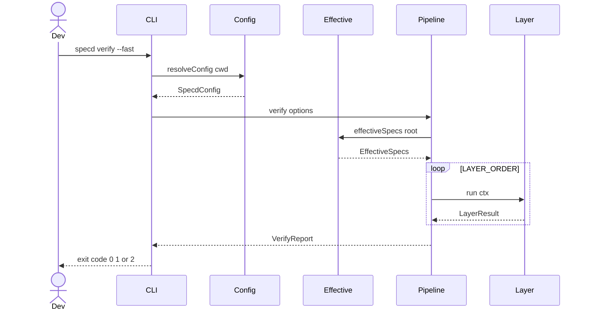
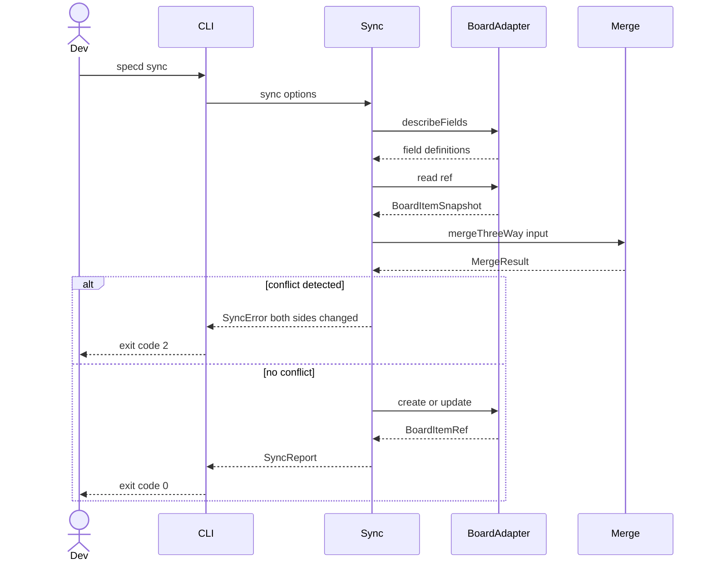
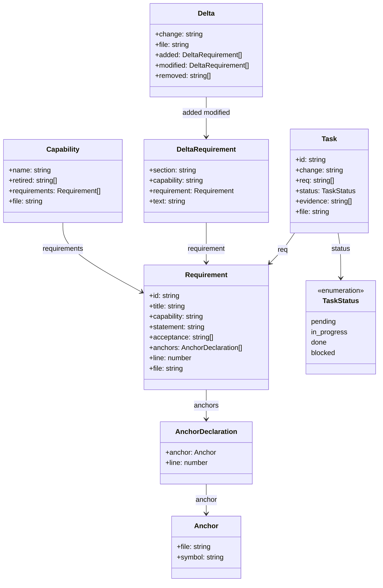
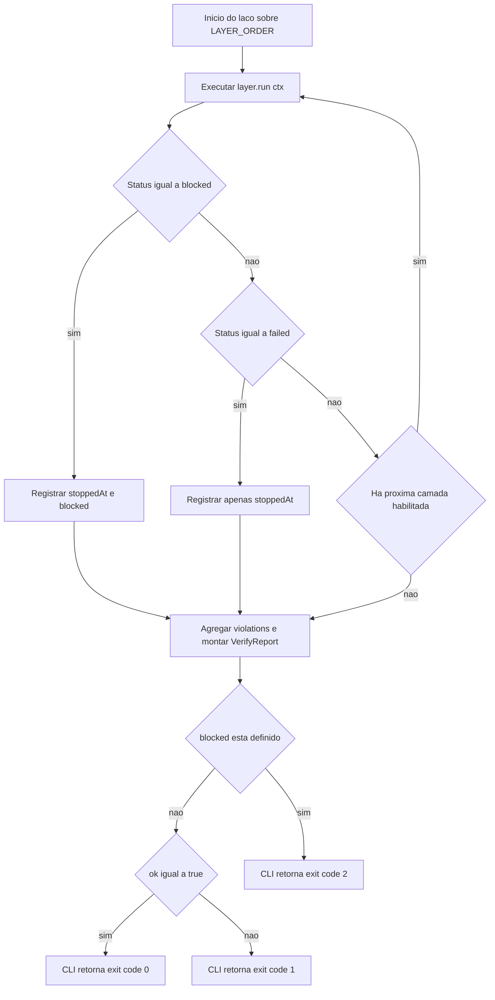
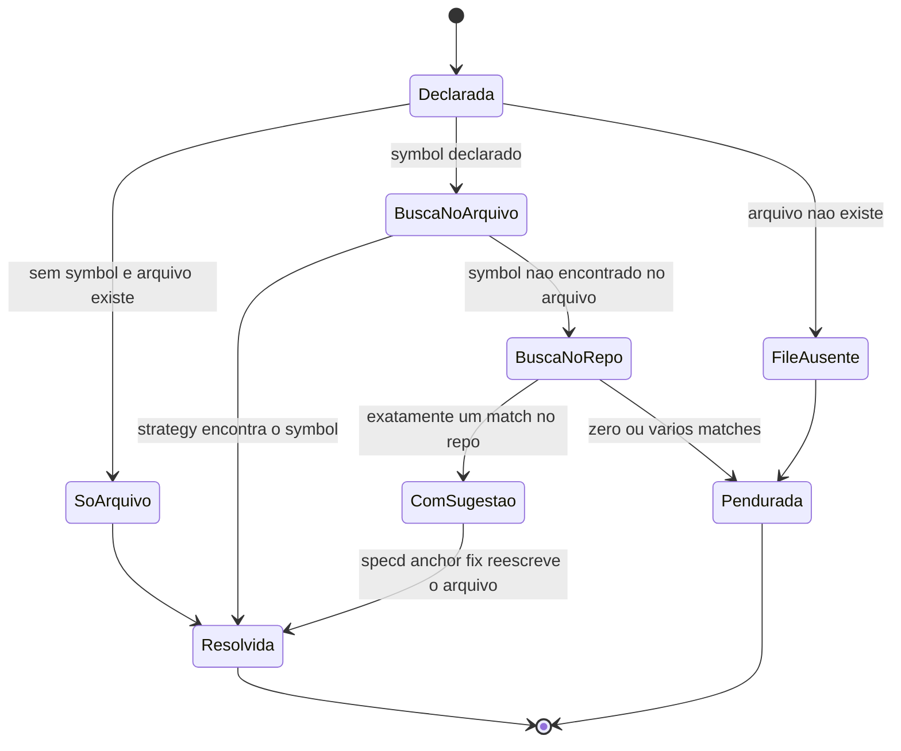
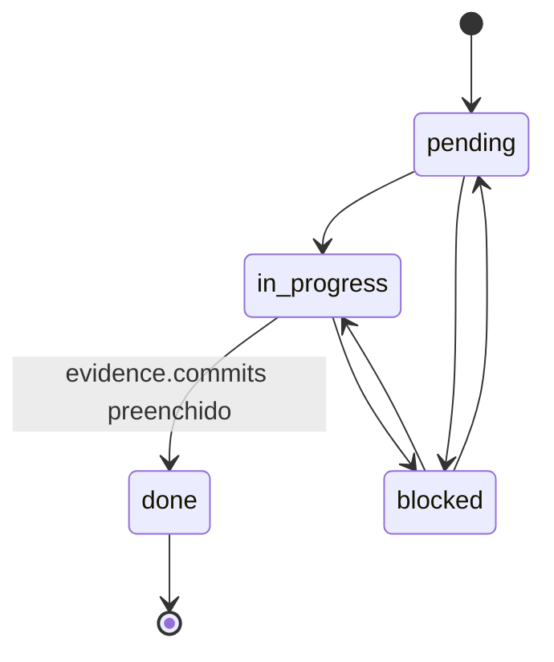

# Diagramas UML do specd

Este documento reúne diagramas UML do repositório `specd`, uma CLI TypeScript
de spec-driven development cujo diferencial é a detecção de drift por
âncoras: cada requisito declara onde é realizado no código, e o gate
(`specd verify`) reprova quando essa âncora deixa de resolver. Os diagramas
foram construídos a partir da leitura direta do código-fonte — em especial
`src/verify/index.ts`, `src/verify/layers/types.ts`, `src/anchors/fix.ts`,
`src/anchors/resolve.ts`, `src/sync/index.ts`, `src/sync/merge.ts`,
`src/parser/capability.ts`, `src/parser/requirement.ts`, `src/parser/delta.ts`,
`src/parser/task.ts`, `src/anchors/model.ts`, `src/sync/adapter.ts` e
`src/cli/index.ts` — e usam nomes reais de tipos, funções e campos.

Cinco diagramas cobrem quatro visões diferentes: dois diagramas de sequência
(o fluxo de `specd verify` e o fluxo de `specd sync` com merge de três vias),
um diagrama de classes (os modelos parseados de spec: `Capability`,
`Requirement`, `Anchor`, `Delta`, `Task`), um fluxograma (a decisão camada a
camada dentro do laço de `verify`) e dois diagramas de estado (o ciclo de vida
de uma âncora e o ciclo de vida de uma task).

## Diagrama de Sequência — o gate `specd verify`

`specd verify` é o único comando cujo exit code é um veredito de qualidade
(Princípio P2 do projeto). A função `verify()` em `src/verify/index.ts`
resolve a configuração, carrega o estado efetivo da spec — capabilities de
`.specd/specs/` com os deltas de mudanças abertas sobrepostos, via
`effectiveSpecs()` — e então executa, em ordem fixa (`LAYER_ORDER`, derivada de
`VERIFY_LEVELS`), até seis camadas: `provenance`, `schema`, `coverage`,
`anchors`, `evidence` e `project`. Cada camada implementa a interface
`VerifyLayer` (`src/verify/layers/types.ts`), que expõe `name` e
`run(ctx): Promise<LayerResult>`.

O laço para na primeira camada cujo `LayerResult.status` seja `failed` — e
para também, de forma distinta, quando uma camada retorna `blocked`, que
significa "não consegui verificar" e não "verifiquei e reprovei" (Princípio
P8: ausência de dado nunca é conformidade). `stoppedAt` registra onde o laço
parou por reprovação; `blocked` registra, separadamente, onde ele parou por
incapacidade de rodar. O `VerifyReport` resultante alimenta
`verifyCommand.run()` em `src/cli/index.ts`: se `report.blocked` está
definido, o CLI retorna `EXIT.OPERATIONAL_FAILURE` (2); caso contrário,
`report.ok ? EXIT.OK : EXIT.GATE_FAILURE` (0 ou 1). Nada nesse caminho toca
rede ou modelo de linguagem — é o que os Princípios P1 e P3 exigem, e o que os
testes de arquitetura do repositório impõem.

## Diagrama de Sequência — `specd sync` e o merge de três vias

`sync()`, em `src/sync/index.ts`, é o único comando que escreve num sistema de
terceiro (o board — hoje, Redmine, via `src/sync/adapters/redmine.ts`). Ele é
manual por design (REQ-SYNC-001): nunca roda de um hook, porque uma escrita
externa sem ninguém observando é exatamente o tipo de operação que o
Princípio P9 proíbe fazer em silêncio. A sequência abaixo mostra o núcleo do
fluxo: descobrir os campos vinculados do board (`loadFieldBindings`, que
chama `adapter.describeFields()`), montar a árvore de itens planejados a
partir da spec (`buildSpecTree` + `planBoardItems`), ler o estado atual de
cada item vinculado (`adapter.read`) e comparar as três versões — base
(`synced_hash` gravado no último sync), `ours` (o que a spec diz agora) e
`theirs` (o que o board diz agora) — através de `mergeThreeWay()` em
`src/sync/merge.ts`.

`mergeThreeWay()` produz um de cinco resultados —`create`, `unchanged`,
`push`, `restore` ou `conflict` — mais `converged` quando os dois lados
mudaram mas convergiram para o mesmo valor. Quando o resultado é `conflict`
para qualquer item, `assertNoConflicts()` interrompe tudo antes da primeira
escrita: nenhuma ação é aplicada, nem mesmo as que estariam livres de
conflito, porque um sync parcialmente aplicado deixaria o board num estado
que nenhum dos dois lados descreve (REQ-SYNC-005). Esse é o Princípio P4 em
ação — âmbito ambíguo nunca é resolvido por adivinhação — e é também por que
`sync` responde com exit code 2 (falha operacional) e não 1: recusar um
conflito não é um veredito de qualidade sobre a spec, é a ferramenta se
recusando a agir sem instrução clara.

Vale registrar uma camada adicional que a sequência acima simplifica: antes
de qualquer merge, `sync()` também localiza links órfãos — itens vinculados a
requisitos que saíram da spec — e os classifica via `classifyOrphans()` em
`declared`, `proposed` ou `none`. Só uma morte _declarada_ e sem candidato de
corpo reaparecido fecha o card do board; isso é o próprio Princípio P9 sendo
corrigido dentro do produto, porque uma versão anterior fechava qualquer link
órfão sem perguntar.

## Diagrama de Classes — modelos parseados da spec

Os módulos em `src/parser/` transformam Markdown em estruturas tipadas. Uma
`Capability` (`src/parser/capability.ts`) agrega vários `Requirement`
(`src/parser/requirement.ts`); cada `Requirement` carrega zero ou mais
`AnchorDeclaration`, e cada `AnchorDeclaration` (`src/anchors/model.ts`)
associa um `Anchor` — caminho de arquivo e símbolo opcional — à linha exata
em que foi declarado. Um `Delta` (`src/parser/delta.ts`) é a superfície de
escrita das mudanças abertas: carrega `DeltaRequirement` completos nas seções
`ADDED` e `MODIFIED`, e apenas identificadores na seção `REMOVED`. Uma `Task`
(`src/parser/task.ts`) referencia um ou mais `Requirement` pelo campo `req`,
e carrega sua própria evidência de conclusão (`evidence.commits`).

Duas decisões de modelagem valem destaque. Primeiro, `Capability.retired` é
uma lista de identificadores nunca reutilizáveis — quando um requisito é
retirado pelo processo de `archive`, seu identificador entra ali e o parser
recusa qualquer heading futura que tente reaproveitá-lo (`parseCapability`
detecta essa colisão explicitamente). Segundo, `Anchor` é intencionalmente o
menor modelo do diagrama: apenas `file` e um `symbol` opcional. O Princípio
P7 do projeto — "âncora é necessária, nunca suficiente" — se reflete
diretamente nesse desenho: `Anchor` só sabe apontar para onde o código deveria
estar, nunca julgar se o código ali satisfaz o requisito. Esse julgamento
semântico fica fora de qualquer classe parseada, porque ficaria fora do
caminho determinístico do gate.

## Fluxograma — decisão camada a camada dentro de `verify()`

O laço principal de `verify()` (linhas 90–106 de `src/verify/index.ts`)
decide, a cada camada executada, entre três destinos: continuar para a
próxima camada, parar por reprovação (`failed`) ou parar por incapacidade de
verificar (`blocked`). O fluxograma a seguir traduz esse laço e a decisão de
exit code que o CLI aplica depois de receber o `VerifyReport`.

Duas assimetrias no fluxograma merecem explicação porque não são óbvias lendo
só o nome das variáveis. A primeira é que `blocked` e `failed` param o laço
da mesma forma — ambos definem `stoppedAt` e interrompem o `for` — mas apenas
`blocked` também define a variável `blocked`, e é essa segunda variável, não
`stoppedAt`, que o CLI consulta para decidir entre exit 1 e exit 2. A segunda
é que uma camada desabilitada em `verify.levels` nunca entra nesse laço: ela
é filtrada antes, por `selectLayers()`, e aparece no relatório apenas na lista
`disabled` — nunca como `skipped` dentro de `layers`, porque `skipped` é
reservado para um estado que o próprio `LayerResult` pode reportar
internamente (por exemplo, quando `--fast` pula a camada `project`).

## Diagramas de Estado

### Ciclo de vida de uma âncora

`resolveAnchor()` (`src/anchors/resolve.ts`) percorre uma escada de cinco
passos fixos e determinísticos — nunca consulta rede, relógio ou modelo — até
decidir um de três resultados possíveis: `resolved`, `dangling` ou
`dangling-with-suggestion`. O passo 1 verifica se o arquivo declarado ainda
existe; se não, a âncora já nasce pendurada. O passo 2 resolve trivialmente
uma âncora sem símbolo, pela simples existência do arquivo. Os passos 3 e 4
pedem à estratégia associada à extensão do arquivo (hoje, `grep`; `treesitter`
está na escada mas inatingível na v1) que procure o símbolo dentro do próprio
arquivo declarado. O passo 5, alcançado só quando o símbolo não foi
encontrado ali, busca o símbolo no restante do repositório: exatamente um
resultado vira uma sugestão; zero ou mais de um deixam a âncora pendurada sem
sugestão — porque o Princípio P4 proíbe o specd de escolher entre candidatos
ambíguos.

O estado `ComSugestao` é o único que tem uma transição de saída controlada
por um comando explícito: `specd anchor fix <requirement>`
(`src/anchors/fix.ts`) lê exatamente essa sugestão e reescreve a linha
`file:` do bloco de âncora no arquivo de spec — mas para aí. O arquivo fica
modificado em disco e sem `git add`, porque a reescrita de uma âncora é uma
operação com custo (ela decide, por proxy, onde um requisito é considerado
satisfeito) e o Princípio P9 exige que operações assim fiquem visíveis para
revisão antes de virarem histórico. Não existe transição automática de
`Pendurada` de volta para `Resolvida`: o comando se recusa a agir quando não
há sugestão, retornando exit code 2 como falha operacional, nunca como
veredito de qualidade — esse veredito é exclusividade de `specd verify`.

### Ciclo de vida de uma task

`Task.status` (`src/parser/task.ts`) é restrito a quatro valores —
`TASK_STATUSES = ["pending", "in_progress", "done", "blocked"]` — declarados
na frontmatter de cada arquivo em `.specd/changes/<id>/tasks/`. O parser não
impõe transições entre esses valores: quem os escreve é a pessoa (ou o
processo de `apply`, ainda não implementado neste repositório) editando o
arquivo da task. O que a spec do repositório exige é uma regra de conteúdo, e
não de transição: uma task só pode ser marcada `done` quando
`evidence.commits` contém pelo menos um SHA — e essa exigência é cobrada pela
camada `evidence` de `specd verify`, não pelo parser de `Task` em si.

Note que `blocked` é alcançável tanto a partir de `pending` quanto de
`in_progress`, e pode retornar a qualquer um dos dois — o modelo de dados não
distingue de onde o bloqueio veio, só que ele existe agora. `done` é o único
estado terminal do diagrama: nada no parser impede reabrir uma task já
concluída reescrevendo o campo `status`, mas a camada `evidence` do gate
trataria qualquer volta a `pending` ou `in_progress` sem removerem o SHA já
presente como um estado normal e não como uma violação — o gate audita
evidência para `done`, não a monotonicidade da transição em si, porque isso
seria um julgamento de processo que o Princípio P1 mantém fora do caminho
determinístico.

## Síntese

Os cinco diagramas acima cobrem o caminho crítico do `specd`: como o gate
decide (`verify`, em sequência e em fluxograma), como a única escrita externa
do produto reconcilia dois estados sem nunca adivinhar (`sync`, em
sequência), qual é a forma dos dados que tudo isso lê (`Capability`,
`Requirement`, `Anchor`, `Delta`, `Task`, em diagrama de classes) e como os
dois artefatos mais versáteis do modelo — a âncora e a task — evoluem de
estado em estado (diagramas de estado). Juntos, eles deixam visível a
disciplina central do projeto: determinismo no que decide o exit code,
recusa explícita diante de ambiguidade, e visibilidade obrigatória para toda
operação que tenha custo — sejam elas escritas no board de um cliente ou a
reescrita de uma única linha de âncora.
