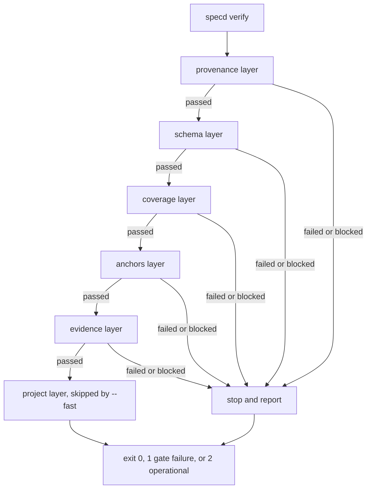

# specd — Wiki Técnica

`specd` é uma CLI de _spec-driven development_ escrita em TypeScript (Node
`>=20`, ESM), publicada como `@jnerytech/specd` com o binário `specd`. O seu
diferencial não é gerar specs a partir de código nem código a partir de specs
— é **detectar drift entre os dois por âncoras**: cada requisito declara em
que arquivo e símbolo ele é realizado, e `specd verify` reprova (exit code 1)
no instante em que essa âncora deixa de resolver contra o working tree.

O repositório é ao mesmo tempo o produto e o primeiro cliente do produto: as
capabilities em `.specd/specs/` descrevem o próprio `specd`, e `npm run
verify` — chamado pela camada `project` do próprio `specd verify` — fecha o
loop.

---

## 1. Arquitetura

### 1.1 Modelo mental

O sistema inteiro gira em torno de três artefatos textuais versionados em
`.specd/`:

- **`.specd/specs/*.md`** — as _capabilities_ realizadas: cada arquivo é uma
  capability com frontmatter YAML (`capability`, `retired`) e requisitos como
  headings de nível 3 (`### REQ-XXX-000`). Cada requisito carrega um
  _statement_ em gramática EARS, critérios de aceite em prosa e,
  opcionalmente, um bloco `yaml anchors` apontando para `file`/`symbol` no
  código.
- **`.specd/changes/<nome>/`** — uma _change_ aberta: contém `delta.md` (as
  seções `ADDED`, `MODIFIED`, `REMOVED` sobre as capabilities), `tasks/*.md`
  (cada task referencia requisitos via `req` no frontmatter) e, opcionalmente,
  `explore/manifest.json` e `memory/`.
- **`.specd/changes/archive/<nome>/`** — o mesmo diretório depois que
  `specd archive` aplicou o delta às capabilities e moveu a change para fora
  do conjunto "aberto".

Esse é o "Modelo B": `.specd/specs/` só contém verdade já realizada. Um
requisito de comportamento que ainda não existe em código mora no `delta.md`
de uma change aberta, nunca direto na spec — evita âncora permanentemente
pendurada num lugar que promete código existente.

### 1.2 As seis camadas do gate

`specd verify` (`src/verify/index.ts`, função `verify`) executa seis camadas
em ordem fixa e não configurável — só _quais_ rodam é configurável via
`verify.levels`:

1. **provenance** (`src/verify/layers/provenance.ts`) — se a change tem fonte
   `required` configurada, exige `explore/manifest.json` presente e todas as
   fontes obrigatórias com status `ok`.
2. **schema** (`src/verify/layers/schema.ts`) — valida a forma dos artefatos:
   IDs de requisito, ausência de `status` em requisito, reuso de identificador
   `retired`, gramática EARS do statement.
3. **coverage** (`src/verify/layers/coverage.ts`) — todo requisito em `ADDED`
   ou `MODIFIED` de uma change precisa de ao menos uma task da própria change
   cujo `req` o cite.
4. **anchors** (`src/verify/layers/anchors.ts`) — resolve cada âncora contra
   o working tree pela escada determinística (ver §1.3) e aplica a política
   graduada (`applyAnchorPolicy`).
5. **evidence** (`src/verify/layers/evidence.ts`) — task `done` sem
   `evidence.commits` reprova; SHA não alcançável no histórico produz warning,
   não reprovação; histórico de git inacessível é falha operacional (exit 2),
   não veredito.
6. **project** (`src/verify/layers/project.ts`) — a única camada com rede ou
   I/O de processo permitidos: executa `validation_command` como array argv
   (sem shell) e propaga o exit code. Só ela é pulada com `--fast`.

Cada camada devolve um `LayerResult` com `status` (`passed | failed |
blocked`), lista de `violations` com severidade. O pipeline para no primeiro
`failed` ou `blocked`; `blocked` significa "não consegui formar veredito" e
vira exit code 2 (falha operacional), nunca 1 — distinção central de P8: um
gate que não conseguiu verificar não pode responder como se tivesse
aprovado.



### 1.3 A escada de resolução de âncoras

O coração do produto é `resolveAnchor` (`src/anchors/resolve.ts`). Para cada
âncora, cinco passos ordenados, primeiro que casar vence — determinístico,
sem consultar relógio, rede ou modelo:

1. `FILE_MISSING` — arquivo declarado não existe → `dangling`.
2. `FILE_ONLY` — âncora sem `symbol`, arquivo existe → `resolved`.
3. `GREP` — a estratégia associada à extensão do arquivo (`strategyFor`,
   `src/anchors/strategy.ts`) encontra o símbolo como identificador delimitado
   (não substring) → `resolved`.
4. `TREESITTER` — reservado; na v1 `strategyFor` já recusa `strategy =
"treesitter"` como erro de configuração antes de chegar aqui (REQ-ANC-005).
5. `REPO_SEARCH` — busca o símbolo no repositório inteiro
   (`findSymbolInRepo`, `src/anchors/search.ts`), excluindo `.specd/`,
   `openspec/` e `docs/` (para não "encontrar" o símbolo na própria capability
   que o declara). Exatamente um match → `dangling-with-suggestion`; zero ou
   mais de um → `dangling` sem sugestão, porque **specd nunca adivinha entre
   candidatos** (P4).

A listagem de arquivos para o passo 5 cai de `git ls-files` para uma
caminhada manual do filesystem quando o git devolve zero resultados
(`listRepository`, `src/anchors/search.ts`) — corrige o caso de um projeto
specd dentro de uma árvore ignorada pelo repositório pai, onde `git`
"sucede" retornando nada e a rede de segurança silenciosamente desaparecia.

### 1.4 Módulo de sincronização com board (Redmine)

`src/sync/` implementa reconciliação de três vias entre a spec e um board
externo, isolada atrás da interface `BoardAdapter`
(`src/sync/adapter.ts`) — `create`, `update`, `link`, `close` (escritas) e
`read`, `describeFields` (leituras). O único adaptador implementado é
`src/sync/adapters/redmine.ts`; qualquer afirmação sobre Azure DevOps neste
repositório seria dedução, não código medido.

Pontos de desenho relevantes:

- O hash de reconciliação é computado sobre uma **projeção normalizada**
  (`normalizeProjection`, `src/sync/hash.ts`), não sobre o payload bruto —
  Redmine devolve `null` para campo simples vazio e `[]` para multivalorado
  vazio, e sem normalização isso produziria conflito falso a cada execução.
- Conflito de três vias (`mergeThreeWay`, `src/sync/merge.ts`) nunca é
  resolvido automaticamente: os dois lados divergindo entre si e do hash
  gravado interrompe com exit code 2 listando os itens, sem escrever nada em
  nenhum lado.
- Fechar um item de board (`close`) é a única escrita de _status_ que o
  specd faz, e por isso é a única que **relê e confirma** que o estado
  realmente mudou — um tracker do Redmine sem linha de workflow aceita um
  `PUT` de `status_id`, responde 204 e descarta o campo em silêncio; medido
  contra servidor real.

### 1.5 Coleta de contexto (`explore`)

`src/explore/` coleta fontes configuradas (`board`, `git`, `mcp`, `http`) em
um bundle auditável dentro do diretório da change, gravado antes de qualquer
falha ser reportada (para que uma fonte obrigatória que falhou não apague o
que as outras já coletaram). A síntese em `draft.md` fica deliberadamente fora
da validação do gate — é prosa de rascunho, não contrato.

### 1.6 Hooks do Claude Code

`src/hooks/` instala/desinstala entradas em `.claude/settings.json` e serve
de adaptador entre o contrato de exit code do specd (0/1/2) e o contrato de
hook do host (`ALLOW: 0`, `BLOCK: 2` — ver `src/hooks/protocol.ts`). Os dois
contratos colidem invertidos: o 1 do specd (reprovação) o host trataria como
aviso, e o 2 do specd (falha operacional) o host trataria como bloqueio. O
adaptador (`runHook`, `src/hooks/run.ts`) traduz explicitamente em vez de
deixar o exit code do specd escapar por coincidência.

---

## 2. Configuração do Ambiente de Desenvolvimento

### 2.1 Pré-requisitos

- Node.js `>=20` (declarado em `package.json` → `engines.node`).
- `npm` para instalar dependências e rodar scripts.
- Docker + Docker Compose apenas para a suíte de integração
  (`npm run test:integration`); tudo o mais roda offline.

### 2.2 Bootstrap

`specd` ainda não está publicado no npm registry sob esse nome (o pacote é
`@jnerytech/specd`), então `npx specd` responde 404 até a primeira
publicação. O caminho de desenvolvimento é sempre o clone:

```bash
git clone https://github.com/jnerytech/specd.git
cd specd
npm install
npm run build
node dist/cli.js --help
```

Para expor o binário `specd` no PATH localmente, `npm link` uma vez — depois
disso os exemplos deste documento e do README funcionam com `specd <comando>`
diretamente. Há um teste (`test/distribution/readme.test.ts`) que amarra o
caminho do binário citado no README ao campo `bin` de `package.json`, então
os dois nunca podem divergir silenciosamente.

### 2.3 Scripts do dia a dia

Definidos em `package.json`:

| Script                     | Comando                           | Papel                                                                                                   |
| -------------------------- | --------------------------------- | ------------------------------------------------------------------------------------------------------- |
| `npm run build`            | `tsc -p tsconfig.json`            | compila `src/` para `dist/`                                                                             |
| `npm test`                 | `vitest run`                      | roda toda a suíte unitária/arquitetura                                                                  |
| `npm run lint`             | `eslint src test`                 | lint com `typescript-eslint`                                                                            |
| `npm run format`           | `prettier --write .`              | formatação                                                                                              |
| `npm run verify`           | format + lint + test + build      | **gate offline do próprio repositório**, chamado pela camada `project` de `specd verify` sobre si mesmo |
| `npm run test:integration` | `test/integration/redmine/run.sh` | sobe Redmine via Docker Compose, semeia, roda a suíte de integração e derruba o container               |

`npm run test:integration` é deliberadamente separado de `npm run verify`: se
o gate exigisse Docker, as cinco camadas offline deixariam de ser offline.

### 2.4 Rodando `specd` contra outro repositório

```bash
cd /caminho/do/outro/projeto
node /caminho/do/specd/dist/cli.js init
```

`specd init` faz o scaffold: cria `.specd/specs/`, `.specd/changes/` e
`.specd/changes/archive/`, e escreve um `config.toml` completo com todas as
seções suportadas comentadas, detectando a stack do repositório
(`detectStack`, `src/init/detect-stack.ts`) para propor `validation_command`
(npm test, pytest, `dotnet test`, alvo de Makefile — ou deixa o campo
comentado nomeando o manifesto reconhecido sem comando conhecido).

---

## 3. Organização do Código

```
src/
  cli.ts                  entrypoint executável (shebang)
  cli/
    index.ts              registro de comandos, parsing de argv, USAGE
    exit-codes.ts          EXIT = { OK: 0, GATE_FAILURE: 1, OPERATIONAL_FAILURE: 2 }
  anchors/
    model.ts               tipo Anchor (file + symbol opcional)
    resolve.ts              resolveAnchor — a escada de 5 passos
    search.ts               findSymbolInRepo, listRepository
    strategy.ts              strategyFor — seleciona estratégia por extensão
    strategies/grep.ts        estratégia grep (única implementada na v1)
    suggest.ts               suggestAnchors, TERM_FILE_CEILING
    declarations.ts          listDeclarations — modo `anchor suggest --file`
    fix.ts                   fixAnchor — reescreve âncora para a sugestão
  archive/
    index.ts                archive(), assertArchivable, archiveDestination
    apply.ts                 insertRequirement, replaceRequirement, retireRequirement, planApplication, alreadyApplied
  config/
    schema.ts                ConfigSchema, VERIFY_LEVELS
    resolve.ts                resolveConfig — precedência de 4 níveis
    credentials.ts            resolveToken — só via variável de ambiente
    errors.ts                  ConfigError
  core/
    root.ts                    findProjectRoot / requireProjectRoot
    operational.ts               OperationalError (carrega exit 2)
    conflict.ts                   ConflictError (P4)
  ears/
    patterns.ts                EARS_PATTERNS, KEYWORDS
    parse.ts                    parseStatement, assertSingleShall, assertShallPresent
  explore/
    index.ts                   explore(), assertRequiredSources
    manifest.ts                  ExploreManifest
    paths.ts                     bundlePath
    redact.ts                     redactPayload
    card-ref.ts                   parseCardRef
    sources/{board,git,http,mcp,index,types}.ts   coletores por tipo de fonte
  hooks/
    protocol.ts                  HOOK_EXIT (ALLOW/BLOCK), HOOK_EVENTS
    install.ts                    installHooks, hookCommand
    uninstall.ts                   uninstallHooks
    run.ts                         runHook — adaptador de contrato de exit code
    settings.ts                     mergeHookEntries, readSettings
  init/
    index.ts                    init(), formatInitResult
    config-template.ts            DEFAULT_CONFIG
    detect-stack.ts                detectStack
    gitattributes.ts                 GENERATED_PATTERNS
  parser/
    capability.ts                parseCapability, loadCapabilities
    delta.ts                       parseDelta, assertFullReplacement, assertSectionReadable
    requirement.ts                  parseRequirement, assertNoStatus
    requirement-id.ts                REQ_ID_PATTERN, isValidRequirementId
    anchors.ts                        parseAnchorBlock
    task.ts                            TaskFrontmatterSchema
    frontmatter.ts, markdown.ts, sections.ts, diagnostics.ts   utilitários de parsing
  status/
    index.ts                    status(), formatStatus
    locate.ts                     locateRequirement
    changes.ts                     changeAge, warningDebt
  sync/
    index.ts                    sync(), planActions, classifyOrphans, findOrphanedLinks
    adapter.ts                    interface BoardAdapter
    adapters/redmine.ts             createRedmineAdapter, scanFilter
    merge.ts                      mergeThreeWay, FIELD_OWNERSHIP
    hash.ts                        normalizeProjection
    fields.ts                       bindFields
    link.ts                         writeBoardLinks
    errors.ts                        FieldDefinitionsUnavailableError, BoardRefusedError, UndeclaredOrphanError
  verify/
    index.ts                    verify(), LAYER_ORDER, requireSpecdProject, selectLayers
    changes.ts                   readOpenChanges
    effective.ts                  effectiveSpecs
    report.ts                     VerifyReport, LayerReport, Violation
    layers/
      types.ts                     VerifyLayer, VerifyLayerContext, resultFrom
      provenance.ts, schema.ts, coverage.ts, anchors.ts, evidence.ts, project.ts
```

Cada diretório de `src/` corresponde a exatamente uma capability em
`.specd/specs/` (anchors, archive, cli, config, ears, explore, hooks,
spec-format, sync, verify), com a exceção de que `spec-format` é realizada
majoritariamente em `src/parser/`.

---

## 4. Componentes-Chave / Módulos

### 4.1 `verify` — o gate (`src/verify/`)

Ponto de entrada único de reprovação de qualidade (P2). `verify()` resolve a
raiz do projeto (`requireProjectRoot`), carrega a configuração, exige
`.specd/specs/` existente (senão exit 2 — "diretório vazio não é aprovação",
corrigido na Fatia 2), calcula `effectiveSpecs` (specs mais os deltas de
changes abertas aplicados por cima, parseados uma vez e compartilhados por
todas as camadas) e roda as camadas selecionadas em `LAYER_ORDER`, que é a
própria constante `VERIFY_LEVELS` — não uma segunda lista que poderia
divergir dela.

Nenhum módulo alcançável a partir de `src/verify/index.ts` pode importar
cliente de LLM (P1) ou módulo de rede (P3); a camada `project` é a única
exceção documentada, e ela só faz `child_process`, nunca socket.

### 4.2 `anchors` — resolução e sugestão (`src/anchors/`)

Além da escada de resolução (§1.3), o módulo oferece `anchor suggest` (lista
candidatas por termos extraídos do requisito, descartando termos que casam
mais arquivos que `TERM_FILE_CEILING` — "namespace, não símbolo") e `anchor
suggest --file` (inverte a pergunta: lista o que um arquivo declara em vez de
adivinhar a partir de prosa — `listDeclarations`,
`src/anchors/declarations.ts`), e `anchor fix`, que reescreve a âncora para a
sugestão e **deixa a mudança fora do stage** (P9 — operação que custa não
acontece em silêncio, mas também não vira commit sozinha).

### 4.3 `archive` — aplicação do delta (`src/archive/`)

`specd archive <change>` aplica `ADDED`/`MODIFIED`/`REMOVED` do `delta.md`
às capabilities de `.specd/specs/`, valida e escreve o novo conteúdo de
**todas** as capabilities afetadas antes de mover qualquer arquivo
(`planApplication`), é idempotente por conteúdo em caso de rerun após falha
parcial (`alreadyApplied`), nunca cria commit, e recusa a operação inteira se
qualquer âncora dos requisitos afetados estiver pendurada (P7 —
`assertAllAnchorsResolved` — mesmo sob política `lenient`). Com `--sync`,
reconcilia o board depois de escrever as capabilities; sem a flag, reporta
quantos itens arquivados ficaram fora de sincronia, sem tocar a rede.

### 4.4 `sync` — reconciliação com board (`src/sync/`)

Comando manual, nunca chamado por hook (REQ-SYNC-001, com teste de
arquitetura `no-sync-in-hooks.test.ts` garantindo isso). Falha de `sync`
sempre sai 2, nunca 1 — só `verify` reprova. Trata renomeação de requisito
realizado como caso ambíguo declarado: um card órfão cujo identificador está
`retired` mas cujo corpo reaparece em item planejado sem link é reportado
como candidato a rename, nunca fechado automaticamente (REQ-SYNC-014/015).

### 4.5 `explore` — coleta de contexto (`src/explore/`)

Grava um `manifest.json` por fonte configurada (tipo, nome, obrigatoriedade,
status, caminho de saída, erro), redige campos sensíveis antes de persistir,
e versiona o bundle dentro do diretório da change (nunca em `.gitignore`).

### 4.6 `hooks` — integração com o host (`src/hooks/`)

Instala hooks idempotentes em `.claude/settings.json` preservando qualquer
entrada de terceiros, recusa reinstalar sobre entrada divergente sem
`--force`, e nunca sobrescreve um `settings.json` malformado. `hooks run`
traduz o resultado de `verify` para o protocolo do host (`HOOK_EXIT.ALLOW =
0`, `HOOK_EXIT.BLOCK = 2`).

### 4.7 `parser` — leitura de specs, deltas e tasks (`src/parser/`)

`parseCapability` lê frontmatter YAML + requisitos como headings de nível 3;
`parseDelta` lê `ADDED`/`MODIFIED`/`REMOVED`, rejeitando explicitamente
conteúdo que não é bloco de requisito nem lista de identificadores
(`assertSectionReadable`) — a correção que fechou o bug em que um delta
ilegível era lido como delta vazio e `archive` saía 0 sem ter verificado
nada.

### 4.8 `ears` — gramática de statement (`src/ears/`)

Aceita exatamente cinco padrões (ubiquitous, event-driven, state-driven,
unwanted-behaviour, optional-feature); keywords sempre em inglês
independente do idioma da prosa; rejeita mais de um `SHALL` por statement
(pedindo divisão em requisitos separados) e statement sem `SHALL` algum.

### 4.9 `config` / `init` / `status` (`src/config/`, `src/init/`, `src/status/`)

Precedência de configuração em quatro níveis (flag de CLI > arquivo de
workspace > arquivo global > default embutido), merge campo a campo. Chaves
desconhecidas ou de tipo errado reprovam o load com exit 2. Credenciais só
por referência a variável de ambiente (`token_env`), nunca literal no TOML.
`status` sempre sai 0 — informa, nunca julga — reportando âncoras penduradas,
requisitos sem task, tasks `done` sem evidência e idade/dívida de warning por
change aberta.

---

## 5. Testes

A suíte usa **Vitest** e espelha `src/` em `test/`: `test/anchors/`,
`test/archive/`, `test/config/`, `test/core/`, `test/ears/`, `test/explore/`,
`test/hooks/`, `test/init/`, `test/parser/`, `test/status/`, `test/sync/`,
`test/verify/`.

### 5.1 Testes de arquitetura (`test/architecture/`)

Não testam comportamento — testam a **forma do grafo de imports**, usando um
utilitário próprio `import-graph.ts` (`collectImportGraph`,
`findForbidden`). Garantem os princípios invioláveis mecanicamente:

- **`no-llm-in-verify.test.ts`** (P1 / REQ-CLI-002) — nenhum módulo
  alcançável a partir de `src/verify/index.ts` pode importar `src/llm/**`,
  `@anthropic-ai/*`, `openai`, clientes Google GenAI, LangChain, Ollama,
  `@modelcontextprotocol/*` etc. A lista de padrões proibidos é explícita
  (`FORBIDDEN: ForbiddenRule[]`), então adicionar um cliente de LLM é um diff
  visível e deliberado, nunca um import silencioso.
- **`no-network-in-verify.test.ts`** (P3 / REQ-CLI-005) — nenhum módulo
  alcançável a partir de `verify()` importa `node:https`, `node:net`,
  `node:tls`, `node:dns`, pacotes HTTP (`axios`, `undici`, `got`...) ou
  WebSocket. `node:child_process` é deliberadamente **não** proibido: a
  camada `project` faz shell-out ao comando de validação, e isso não abre
  socket.
- **`no-sync-in-hooks.test.ts`** (REQ-SYNC-001) — nenhum módulo alcançável a
  partir de `src/hooks/run.ts`, nem de `src/verify/index.ts`, importa
  `src/sync/**`. Um hook roda sem ninguém olhando; `sync` escreve num sistema
  de terceiro, e por isso é estritamente manual.
- **`hook-exit-codes.test.ts`** (REQ-HOOK-005) — nenhum módulo sob
  `src/hooks/` importa a tabela `EXIT` do specd, e `protocol.ts` fixa os
  literais `ALLOW: 0` / `BLOCK: 2` do contrato do host sem importar de
  `exit-codes.ts` — os dois contratos colidem invertidos (o 1 do specd é
  veredito, o 2 do host é bloqueio) e o teste garante que a fronteira não
  vaza.

Cada teste de arquitetura inclui um caso "catches an import ... introduced
anywhere in the graph" que cria um grafo temporário artificial com a
violação, provando que o _walker_ de fato falharia caso a regra fosse
quebrada de verdade — não só que ele passa hoje porque não encontrou nada.

### 5.2 Fixtures (`test/fixtures/`)

Diretórios de código minimalistas para exercitar cada saída possível da
escada de resolução: `missing-file`, `resolved-file-only`,
`resolved-with-symbol`, `moved-symbol`, `renamed-symbol`,
`ambiguous-symbol`.

### 5.3 Exemplos documentados (`test/parser/documented-examples.test.ts`)

Extrai os exemplos de `delta.md` e de task publicados na documentação de
formato e os faz passar pelos parsers reais (`parseDelta`, `parseTask`) sem
diagnóstico de erro — garante que a documentação nunca envelhece em
silêncio ficando incompatível com o parser (REQ-FMT-010).

### 5.4 Suíte de integração (`test/integration/redmine/`)

Separada deliberadamente de `npm run verify`: sobe um Redmine real via
Docker Compose (`run.sh`, `docker-compose.yml`), semeia dados (`seed.sh`),
roda a suíte contra o servidor real e derruba o container ao final (a menos
que `--keep` seja passado). É aqui que comportamentos medidos contra o
Redmine real são verificados — por exemplo, que um `PUT` de `status_id` num
tracker sem linha de workflow responde 204 e não aplica nada (a instância
concreta que originou a regra P8 de "releitura confirma escrita").

### 5.5 Rodando os testes

```bash
npm test                    # suíte completa via vitest
npm run test:integration    # requer Docker, sobe/derruba Redmine sozinho
```

---

## 6. Deploy

`specd` não é um serviço com processo rodando — é uma CLI distribuída via
npm registry, então "deploy" aqui significa **publicação de pacote**, não
implantação de infraestrutura.

### 6.1 Estado atual

O pacote **ainda não está publicado** sob o nome usado nos exemplos
(`@jnerytech/specd`, binário `specd`). Enquanto isso for verdade, `npx specd`
responde 404, e o README documenta explicitamente o caminho alternativo do
clone (§2.2) — há um teste de arquitetura amarrando o caminho do binário
citado no README ao campo `bin.specd` de `package.json`
(`test/distribution/readme.test.ts`), e outro cobrindo o próprio pacote
(`test/distribution/package.test.ts`), para que a documentação de
onboarding nunca fique dessincronizada do que o `package.json` de fato
declara.

### 6.2 Fluxo de publicação (skill `publish-npm`)

O repositório inclui uma skill dedicada (`.claude/skills/publish-npm/`) que
formaliza o fluxo de publicação com o gate verde, dry-run revisado,
confirmação explícita do autor e releitura do registry como prova pós-
publicação — a mesma disciplina de P9 (operação que custa não acontece em
silêncio) aplicada à própria distribuição do pacote.

O processo de fato, mecanicamente:

```bash
npm run verify                 # gate offline: format, lint, test, build
npm publish --dry-run          # revisão do que entraria no tarball
npm publish                    # publica @jnerytech/specd no registry
```

`package.json` restringe o conteúdo publicado a `files: ["dist"]`, e
`prepublishOnly`/`build` compilam `src/` (TypeScript) para `dist/cli.js`
(JavaScript ESM), que é o que `bin.specd` aponta. Não há passo de build no
lado do cliente, nem dependência nativa, nem gramática WASM empacotada
(REQ-CLI-006) — pré-requisito para que `npx specd` funcione sem instalação
prévia depois que o nome estiver reservado no registry.

### 6.3 O que não existe

Não há ambiente de staging/produção, não há servidor a monitorar, não há
pipeline de deploy contínuo além de CI rodando `npm run verify` em PRs. O
"ambiente de execução" do specd é o repositório do usuário que o instala —
o produto roda localmente ou em CI de terceiros, nunca como serviço hospedado
pelo próprio time.

---

## 7. Troubleshooting

**`npx specd` retorna 404 / "package not found"**
Esperado até a primeira publicação no registry sob o nome usado. Use o
caminho de clone (§2.2): `git clone` → `npm install` → `npm run build` →
`node dist/cli.js <comando>`, ou `npm link` uma vez para expor `specd` no
PATH.

**`specd verify` sai 2 dizendo "No .specd/specs/ under ..."**
`requireSpecdProject` (`src/verify/index.ts`) recusa formar veredito quando
não há árvore de specs — "diretório vazio" e "não achei nada para checar" são
estados distintos por design (P8), e o segundo nunca é reportado como
aprovação. Rode `specd init` se o diretório deveria ser um projeto specd, ou
rode `verify` a partir da raiz correta — a raiz do projeto é o ancestral mais
próximo que contém `.specd/`, independente de repositório git
(`findProjectRoot`, `src/core/root.ts`).

**Camada `project` bloqueia com exit code 2 em vez de reprovar com 1**
Significa que o executável do `validation_command` não pôde nem ser
invocado (não instalado, caminho errado) — `classifyCommandFailure`
(`src/verify/layers/project.ts`) distingue isso de um comando que executou e
retornou não-zero (esse último é veredito real, exit 1). A mensagem lista as
saídas: instalar o executável, trocar `validation_command`, ou remover
`project` de `verify.levels`.

**Âncora reportada como `dangling` mesmo com o símbolo existindo em outro
lugar do repositório**
Se a busca do passo 5 encontrou mais de um match, ou nenhum, specd
deliberadamente não sugere nada (P4 — nunca adivinhar em conflito). Rode
`specd anchor suggest <capability>` para investigar candidatos, ou
`specd anchor suggest --file <path>` para listar exatamente o que um arquivo
declara e escolher o símbolo certo à mão.

**`specd anchor fix` sai 2 dizendo que não há nada a corrigir**
`fix` só age sobre requisitos cuja resolução chegou a `dangling-with-
suggestion` (match único no passo 5). Ambiguidade ou zero matches não geram
sugestão — a recusa é intencional, não um bug.

**Camada `anchors` produz warning mesmo com toda âncora resolvendo**
Se a listagem de arquivos (`git` ou `walk`, reportado em `listing.mode` e
`listing.files` do `LayerResult`) enxergou zero arquivos, o warning existe
porque "toda âncora resolve" e "toda âncora resolve, e eu saberia procurar se
alguma quebrasse" são estados diferentes (REQ-VER-012). Verifique se o
diretório está sendo ignorado por um `.gitignore` de repositório pai.

**`specd sync` sai 2 com "conflict"**
Os dois lados (spec e board) mudaram desde o último hash sincronizado, e
divergem entre si. specd nunca resolve esse caso automaticamente (P4/REQ-
SYNC-005) — a mensagem lista item, campo e os dois valores; decida à mão qual
prevalece e rode `sync` de novo.

**`specd sync` sai 2 nomeando um "orphan"/candidato a rename**
Um link de board não corresponde a requisito nenhum na spec atual, e não
satisfaz sozinho as condições para fechamento automático. Se o corpo do item
órfão reaparece em um requisito planejado sem link ainda, a mensagem nomeia o
candidato a rename — mas não aplica a renomeação sozinho (REQ-SYNC-015). As
saídas disponíveis são trocar a chave da ligação ou declarar o identificador
em `retired`.

**`npm run test:integration` falha ou trava**
Requer Docker e Docker Compose rodando. `test/integration/redmine/run.sh`
sobe o container, semeia (`seed.sh`) e derruba ao final; use `--keep` para
deixá-lo rodando e iterar manualmente. Este comando é deliberadamente
separado de `npm run verify` — o gate do próprio repositório nunca deve
exigir Docker.

**`specd hooks install` sai 2 dizendo entrada divergente**
Já existe uma entrada de hook do specd em `.claude/settings.json` cujo
comando difere do que está sendo instalado agora (P4 — dois estados
possíveis sem base para escolher automaticamente). Use `--force` para
substituir deliberadamente, ou ajuste `--command` para bater com o existente.

**Configuração recusada por chave desconhecida**
`resolveConfig` (`src/config/resolve.ts`) rejeita qualquer chave fora de
`ConfigSchema` em tempo de load, citando arquivo, chave e chaves válidas
próximas — nunca ignora silenciosamente uma opção mal digitada.
